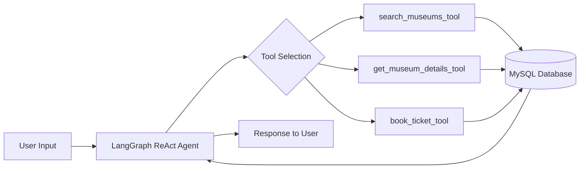

# 🏛️ Museum Chatbot — AI-Powered Ticketing & Information Agent

An intelligent conversational agent that helps users discover Indian museums, explore detailed information, and book tickets — all through natural language. Built with **LangGraph**, **LangChain**, and a locally-hosted **Llama 3.2** model via **Ollama**.

---

## ✨ Features

| Feature | Description |
|---|---|
| 🔍 **Smart Museum Search** | Fuzzy-matched search by museum name, city, or state/region |
| ♿ **Accessibility Filter** | Filter for wheelchair-accessible museums |
| 📋 **Detailed Info Retrieval** | Get address, pricing, timings, facilities, and more |
| 🎟️ **Ticket Booking** | Book tickets with real-time capacity checking and date validation |
| 🧠 **Stateful Conversations** | Multi-turn memory powered by LangGraph's `MemorySaver` |
| 🔒 **No Hallucinations** | Agent is strictly grounded — all answers come from the database |
| 🏠 **Fully Local** | Runs entirely on your machine — no API keys, no cloud dependency |
| 🖥️ **Streamlit UI** | Web-based chat interface with New Chat button and response timer |
| ✂️ **Smart History Trimming** | Automatically trims conversation history to prevent context window overflow |

---

## 🏗️ Architecture

```
museum_chatbot/
├── core/
│   ├── __init__.py        # Package initializer
│   ├── db.py              # MySQL connection pool
│   ├── llm.py             # LangGraph ReAct agent + history trimming
│   └── tools.py           # LangChain tools (search, details, booking)
├── app.py                 # Streamlit web UI
├── terminal.py            # CLI entry point
├── requirements.txt       # Python dependencies
├── .env                   # Environment variables (DB credentials)
└── README.md
```

### How It Works



1. **User** sends a natural-language query via the Streamlit UI or terminal
2. **LangGraph ReAct Agent** (powered by Llama 3.2) reasons about which tool to call
3. **Tools** execute fuzzy-matched SQL queries against the MySQL database
4. **Agent** synthesizes the tool output into a clean, conversational response
5. **Memory** persists across turns, enabling multi-step workflows like search → details → book

---

## 🛠️ Tech Stack

- **LLM** — [Llama 3.2](https://ollama.com/library/llama3.2) (local, via Ollama)
- **Agent Framework** — [LangGraph](https://github.com/langchain-ai/langgraph) (ReAct agent with checkpointing)
- **Tool Bindings** — [LangChain](https://github.com/langchain-ai/langchain)
- **Frontend** — [Streamlit](https://streamlit.io/) (chat UI)
- **Database** — MySQL with connection pooling
- **Fuzzy Matching** — Python `difflib` for typo-tolerant search

---

## 🚀 Getting Started

### Prerequisites

- **Python 3.10+**
- **MySQL** server running locally
- **Ollama** installed — [Install Ollama](https://ollama.com/download)

### 1. Clone the Repository

```bash
git clone https://github.com/Yash-lab01/Museum-Chatbot.git
cd Museum-Chatbot
```

### 2. Pull the Llama 3.2 Model

```bash
ollama pull llama3.2
```

### 3. Set Up the Database

Create the `museum` database and the required tables in MySQL:

```sql
CREATE DATABASE IF NOT EXISTS museum;
USE museum;

-- Create the museum_data table (populate with your dataset)
CREATE TABLE museum_data (
    Name VARCHAR(255),
    City VARCHAR(100),
    State_UT VARCHAR(100),
    Address TEXT,
    Theme VARCHAR(255),
    Year_of_Establishment VARCHAR(50),
    Facilities TEXT,
    Admission TEXT,
    Adult_Price DECIMAL(10,2),
    Child_Price DECIMAL(10,2),
    Timings VARCHAR(255),
    Closed_Days VARCHAR(255),
    Overview TEXT,
    Wheelchair BOOLEAN DEFAULT 0
);

-- Create the bookings table
CREATE TABLE bookings (
    id INT AUTO_INCREMENT PRIMARY KEY,
    museum_name VARCHAR(300),
    booking_date DATE,
    adults INT,
    children INT,
    total_price DECIMAL(10,2),
    created_at TIMESTAMP DEFAULT CURRENT_TIMESTAMP
);
```

### 4. Configure Environment Variables

Create a `.env` file in the project root:

```env
DB_HOST=localhost
DB_USER=root
DB_PASSWORD=your_password
DB_NAME=museum
```

### 5. Install Dependencies

```bash
python -m venv venv
source venv/bin/activate   # On Windows: venv\Scripts\activate
pip install -r requirements.txt
```

### 6. Run the Chatbot

**Streamlit UI (recommended):**
```bash
streamlit run app.py
```

**Terminal mode:**
```bash
python terminal.py
```

> **Note:** Always run from within the virtual environment. On Windows, use `venv\Scripts\activate` first, or run `.\venv\Scripts\streamlit.exe run app.py` directly.

---

## 💬 Usage Examples

```
🤖 Museum Bot Ready. Type 'exit' to quit.
----------------------------------------

You: Show me museums in Kolkata

Bot: Found 3 matching museums:
- **Indian Museum** in **Kolkata**, West Bengal (Open: 10:00 AM - 5:00 PM)
- **Victoria Memorial Hall** in **Kolkata**, West Bengal (Open: 10:00 AM - 6:00 PM)
- **Science City** in **Kolkata**, West Bengal (Open: 9:00 AM - 8:00 PM)

You: Tell me more about Indian Museum

Bot: Details for Indian Museum (Kolkata):
Address: 27, Jawaharlal Nehru Rd, West Bengal
Theme: General (Est. 1814)
Adult Price: ₹75 | Child Price: ₹20
Timings: 10:00 AM - 5:00 PM (Closed on Mondays)
...

You: Book 2 adult tickets for 2026-06-15

Bot: Success! Booked 2 Adults and 0 Children for Indian Museum (Kolkata)
on 2026-06-15. Total Price: ₹150.
```

---

## 🧩 Tools Reference

| Tool | Purpose | Parameters |
|---|---|---|
| `search_museums_tool` | Search museums by name, city, state, or region | `query` (str), `needs_wheelchair` (bool) |
| `get_museum_details_tool` | Get full details for a specific museum | `museum_name` (str), `city` (str) |
| `book_ticket_tool` | Book tickets with capacity validation | `museum_name`, `city`, `booking_date`, `adult_count`, `child_count` |

---

## ✂️ Context Management

Long conversations can overflow the LLM's context window (8192 tokens). This project handles it with two mechanisms:

| Mechanism | How It Works |
|---|---|
| **History Trimming** | Uses LangChain's `trim_messages` to keep only the last **20 messages** before each LLM call. Older messages are dropped automatically. The `start_on="human"` flag ensures tool-call/response pairs are never split mid-sequence. |
| **New Chat** | The Streamlit UI's "✨ New Chat" button generates a fresh `thread_id`, giving the agent a completely clean slate — no prior history loaded. |

The trim limit is configurable via `MAX_HISTORY_MESSAGES` in `core/llm.py`.

---

## ⚙️ Configuration

| Variable | Description | Default |
|---|---|---|
| `DB_HOST` | MySQL host | `localhost` |
| `DB_USER` | MySQL username | — |
| `DB_PASSWORD` | MySQL password | — |
| `DB_NAME` | Database name | — |
| Model (`llm.py`) | Ollama model name | `llama3.2` |
| `num_ctx` (`llm.py`) | Context window size | `8192` |
| `MAX_HISTORY_MESSAGES` (`llm.py`) | Max messages kept in history | `20` |
| `max_capacity` (`tools.py`) | Max tickets per museum per day | `50` |

---

## 📄 License

This project is open-source and available under the [MIT License](LICENSE).

---

<p align="center">
  Built with ❤️ using LangGraph + Ollama
</p>
